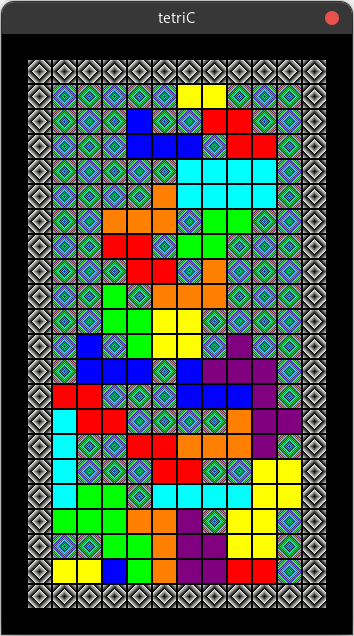

## Unfinished tetris ripoff in c



requirements:  
 - sdl2
 - sdl2_mixer
 - sdl2_image

to build and run:  
```shell
make all run
```
controls:  
 - (a,d) or (left, right) to move left and right.  
 - (w) or (up) to rotate
 - (s) or (down) to fall faster
 - (x) to fall instantly